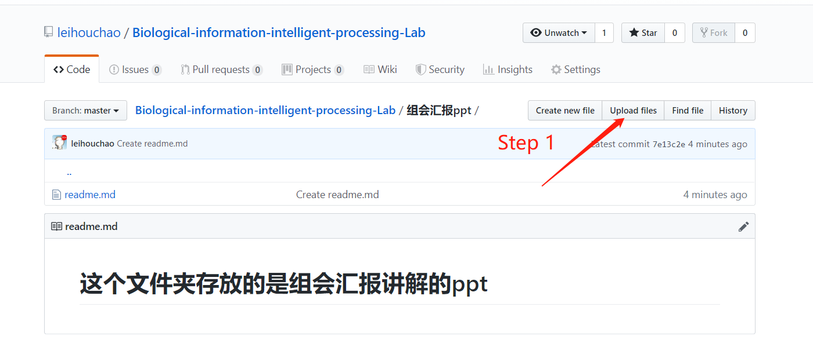

# Biological-information-intelligent-processing-Lab
## 上海交通大学生物信息智能处理实验室组会论文仓库

请各位同学按照以下格式在每次组会开始的前一天晚上将文件上传相应的文件夹中：
    
    1，需要上传的文件包括:
       （1）组会汇报ppt
       （2）所选论文
       （3）论文简介（中英文均可）
       
    2，上传文件命名格式：
       （1）ppt的命名格式：2019下半年第一周_2019-9-9_张三_cvpr2019_Adaptive Weighting Multi-Field-of-View CNN for Semantic Segmentation in Pathology.pptx
       （2）论文：2019下半年第一周_Adaptive Weighting Multi-Field-of-View CNN for Semantic Segmentation in Pathology.pdf
       （3）论文简介：2019下半年第一周_cvpr2019_AWMF-CNN论文简介.pdf

上传操作示例：

    
